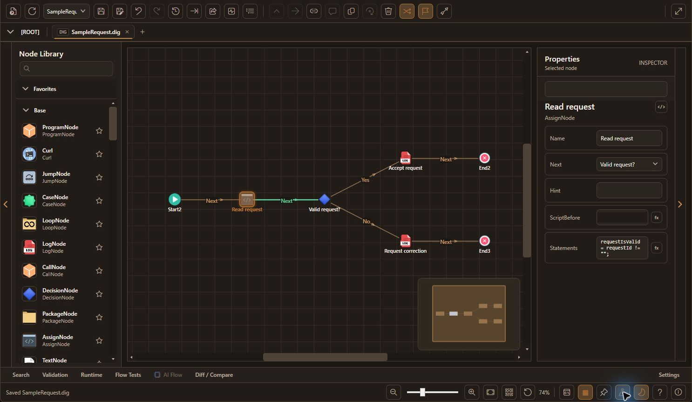
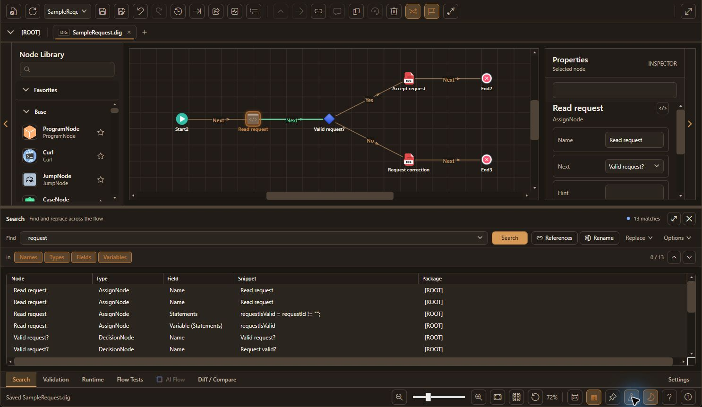
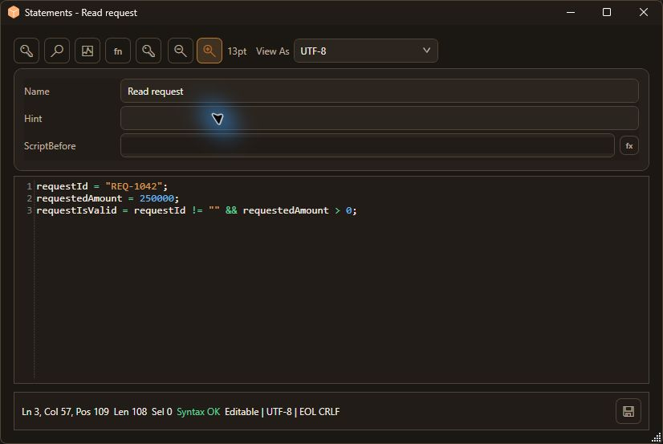
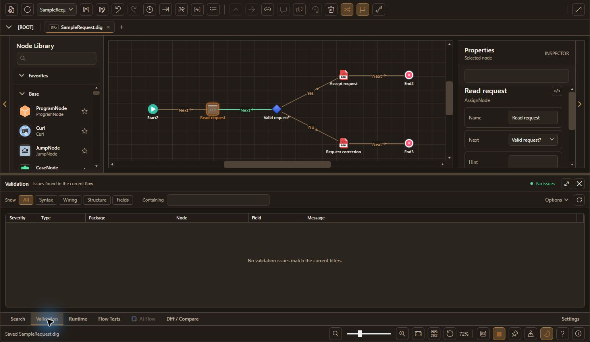
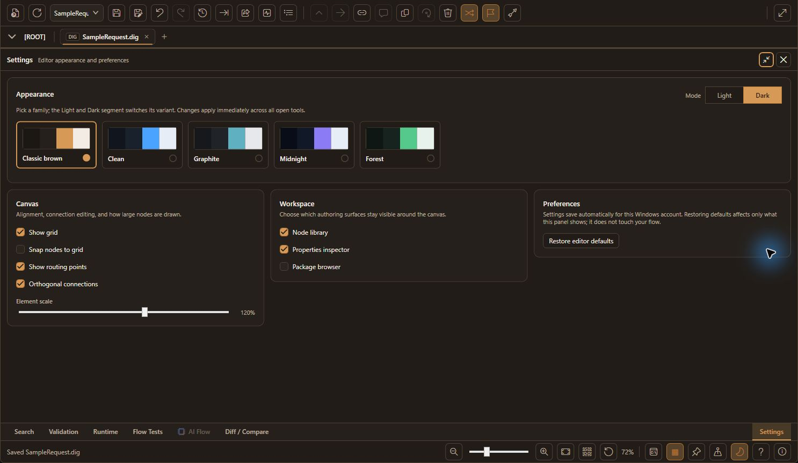

# FlowCraft

FlowCraft is a Windows desktop visual editor for designing, reviewing, and maintaining ATM and business flow configurations.

This repository is the public showcase for FlowCraft. It presents the product, feature set, screenshots, ownership, and safe metadata only. The production editor source code, runtime logic, parser implementation, internal assets, and commercial build pipeline remain private.

## Creator

Created and owned by Amirsalar Saberi rad.

Website: https://amirsrad.ir

## What FlowCraft Does

- Visual node-based flow editing for ATM/business workflows.
- Package navigation for large nested flows.
- Connection creation, routing, labels, route points, and validation.
- Node search, variable search, replace, command palette, and diff/compare tools.
- Expression/script editing with syntax assistance, function validation, autocomplete, and variable browsing.
- Comment boxes, minimap, zoom, snap/grid, selection sets, and undo/redo.
- Light and dark UI modes.
- Docked, expandable workspaces for Search, Validation, Runtime, AI Flow, Diff / Compare, and Settings.
- Development JSON project format beside production `.dig` / `.dml` compatibility in the private product.
- AI Flow assistant for generating and modifying graph patches from natural language prompts.
- React-style UI Designer for flow-linked screen nodes, including visual editing, assets, design tokens, templates, live preview, responsive mode, and React export.

## Screenshots

These screenshots show the FlowCraft desktop application running a synthetic
sample flow; no customer project data is included.

Search across node names, fields, scripts, and variables without leaving the canvas.

Write expressions and scripts with syntax highlighting and validation.

Review validation results beside the graph.

Personalize themes, light/dark mode, canvas options, and workspace preferences.

## AI Flow Assistant

FlowCraft includes an AI-assisted flow editing panel in the private desktop product.

Current capabilities:

- Gemini-compatible model selection.
- Selected-node, current-context, and whole-flow scopes.
- Compact context prompts to reduce token usage.
- Hidden detail requests so the model can ask for only the package/node details it needs.
- Patch preview before apply.
- Local validation before changes are committed to the graph.
- Supported patch operations: create nodes, create package-contained subflows, update existing nodes, add connections, and explicitly remove connections.

## UI Designer

FlowCraft includes a WebView2-powered screen designer for `UiScreenNode` screens.

Current capabilities:

- Desktop canvas with custom dimensions and a `1024 x 1280` default.
- Fixed and responsive output modes.
- Drag/resize editing with alignment guides, snapping, layer ordering, align, and distribute tools.
- Elements for text, buttons, images/GIFs, form controls, panels, flex/grid containers, cards, tables, tabs, modals, shapes, badges, dividers, and icons.
- Rich styling for colors, gradients, borders, radii, fonts, shadows, opacity, and backgrounds.
- Asset folder workflow for images and GIFs.
- Design tokens for colors, spacing, radii, and fonts.
- Full-page templates such as receipt, approval form, data entry, and status card.
- Reusable components from selected elements.
- Live preview and schema checks.
- React component export with `$flow.name` value resolution and flow event hooks.
- Source-owned React page/component imports, managed builds, and auto-build.
- Page transitions and element animation settings with preview support.
- Action cards, CAPTCHA, selectable tables, project fonts, and input interaction styling.

## Technology

The private product is built around:

- C#
- .NET 8
- WPF
- WebView2
- FlowCore-compatible graph/runtime formats

This public repository contains only safe showcase metadata and a small .NET project for GitHub language classification.

## Repository Scope

Included here:

- Public README
- Public ownership/license notice
- Showcase scope documentation
- Safe metadata project

Not included here:

- Production source code
- Runtime parser/serializer implementation
- Proprietary `.dig` / `.dml` internals
- Commercial assets
- Build/publish/obfuscation pipeline
- Private test data
- Internal customer/runtime integrations

## Status

FlowCraft is a private production project. This repository is public showcase material only.
